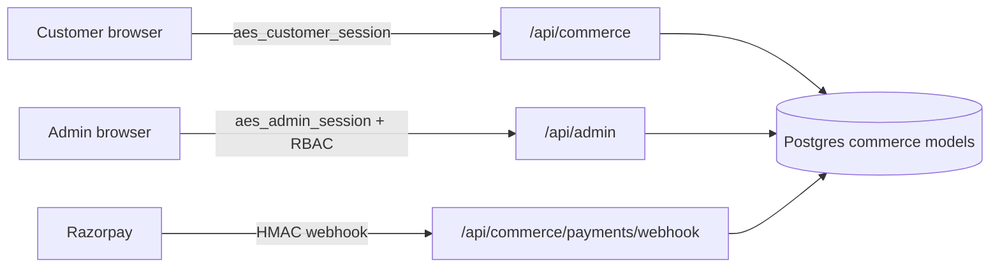

# Architecture Risk Report — yashlp (Only Aesthetics + CivicLens)

**Date:** 2026-07-15  
**Branch:** `cursor/go-live-security-306c`  
**Risk score:** 33 / 100 (Low–Moderate) — `log10(20+1)×25 ≈ 33` from 2 medium residual risks after hardening

## Architecture at a glance

| Layer | Stack |
|-------|--------|
| App | Next.js App Router (TypeScript) |
| Data | Prisma → PostgreSQL (Neon) |
| Payments | Razorpay (UPI/cards/netbanking) |
| Storefront | `/aesthetics` + `/api/commerce/*` |
| Admin | `/admin` + `/api/admin/*` (RBAC) |
| Community | CivicLens (isolated cookies/routes) |

### Connection model (storefront ↔ admin)

Shared models: `CommerceCustomer`, `CommerceOrder`, `CommercePayment`, `CommerceProduct`, `CommerceReview`.

## What works well (post-hardening)

1. **Server-authoritative checkout pricing** (`checkout-pricing.ts`) — client prices ignored.
2. **Razorpay order binding + webhook** — verify cannot confirm the wrong order with a valid signature.
3. **Separate admin/customer cookies** with middleware soft-gate on `/admin` and `/api/admin`.
4. **Customers CRM** — admin sees the same customers/orders as the storefront.
5. **Production deploy no longer resets demo passwords** (`SEED_DEMO_USERS=false` default).

## Residual risks

| Severity | Area | Notes |
|----------|------|-------|
| Medium | In-memory rate limits | Use Upstash/Redis before heavy traffic |
| Medium | Admin MFA delivery | Wire `COMMERCE_ADMIN_OTP_WEBHOOK` / Resend before `COMMERCE_ADMIN_REQUIRE_OTP=true` |

## STRIDE (post-hardening)

| Category | Count | Notes |
|----------|------:|-------|
| Spoofing | 0 | Cookie sessions + RBAC on admin APIs |
| Tampering | 0 | Pricing/payment binding fixed |
| Repudiation | 1 | Expand audit logging for more mutations |
| Info disclosure | 0 | Demo passwords removed from UI/docs |
| DoS | 1 | Rate limits not multi-instance |
| Elevation | 0 | Admin soft-gate + `withAdminAuth` |

## Remediation roadmap

**Before launching payments**

1. Set Vercel env from `docs/GO_LIVE_SECURITY.md`
2. Configure Razorpay webhook secret + live keys
3. Rotate any previously published passwords
4. Keep `ALLOW_DEMO_PAYMENTS` / `SEED_DEMO_USERS` / `ALLOW_DEMO_OTP` false

**This sprint**

- Upstash rate limiting for auth/checkout
- Admin OTP email via Resend then enable MFA

## PR

https://github.com/yashlp/yashlp/pull/11
